# Awesome Secure Enterprise Browser 🛡️

<p align="center">
  
</p>

<p align="center">
  <a href="https://github.com/ishandutta2007/Awesome-Awesome-Awesome"></a>
  <a href="https://discord.gg/jc4xtF58Ve"></a>
  <a href="https://github.com/ishandutta2007/Awesome-Secure-Enterprise-Browser/stargazers"></a>
  <a href="https://github.com/ishandutta2007/Awesome-Secure-Enterprise-Browser/network/members"></a>
  <a href="https://github.com/ishandutta2007/Awesome-Secure-Enterprise-Browser/blob/main/LICENSE"></a>
  <a href="https://github.com/ishandutta2007"></a>
</p>

---

## 📑 Overview & Ecosystem Landscape

A curated, SEO-indexed directory of **Secure Enterprise Browsers**, **Remote Browser Isolation (RBI)**, **Browser Data Loss Prevention (DLP)**, **Zero-Trust Web Access (ZTNA)**, and **Last-Mile Browser Security** solutions.

Modern enterprise cybersecurity has pivoted to the browser as the primary endpoint runtime. Enterprise browsers and isolation technologies protect distributed workforces, BYOD endpoints, and contractor machines from web threats, malicious extensions, prompt leakage in Generative AI tools, and zero-day vulnerabilities.

---

## 🧭 Table of Contents

- [📑 Overview & Ecosystem Landscape](#-overview--ecosystem-landscape)
- [☁️ SaaS & Commercial Enterprise Platforms](#️-saas--commercial-enterprise-platforms)
- [⚡ Open-Source GitHub Projects](#-open-source-github-projects)
- [🛠️ Architecture & Deployment Archetypes](#️-architecture--deployment-archetypes)
- [🤝 How to Contribute](#-how-to-contribute)
- [📈 Star History](#-star-history)
- [⚠️ Disclaimer](#️-disclaimer)

---

## ☁️ SaaS & Commercial Enterprise Platforms

> 📊 **Market Overview**: The Secure Enterprise Browser & Remote Browser Isolation (RBI) market is estimated at **$7.2 Billion – $8.5 Billion** and projected to exceed **$21+ Billion by 2034 (CAGR of 28% – 31%)**. The sector is currently **moderately fragmented**—transitioning from isolated point solutions to an enterprise consolidation phase led by Tier-1 cybersecurity/cloud giants (SASE/SSE) alongside high-growth unicorn platforms.

The table below summarizes leading commercial platforms, sorted in descending order by parent company scale (market valuation / revenue capitalization):

| Platform | Organization & Scale | Focus & Core Capabilities | Starting Pricing | Free Tier / Free Trial Limits |
| :--- | :--- | :--- | :--- | :--- |
| **[Microsoft Edge for Business](https://www.microsoft.com/edge/business)** | **Microsoft**<br><sub>~$3.1 Trillion Market Cap / ~$245B+ Rev</sub> | Dual-identity enterprise browsing, automatic personal/work profile switching, Microsoft Entra ID integration, Intune MAM policies, and data leakage controls. | **Included with Microsoft 365**<br><sub>(M365 plans start at **$6.00 / user / mo**; standalone Edge binary is $0)</sub> | **Free forever** with personal Microsoft Account or Entra ID Free; **30-day free trial** for M365 Business/Enterprise plans (up to 25 seats). |
| **[Google Chrome Enterprise Premium](https://chromeenterprise.google/)** | **Alphabet / Google**<br><sub>~$2.1 Trillion Market Cap / ~$350B+ Rev</sub> | Deep enterprise policy orchestration, browser-level DLP, real-time URL classification, context-aware zero-trust access, and built-in malware analysis. | **$6.00 / user / month**<br><sub>($72.00 / user / year)</sub> | **60-day free trial** (up to 5,000 users); **Chrome Enterprise Core** is free forever for centralized browser policy management. |
| **[Prisma Browser (Talon)](https://www.paloaltonetworks.com/prisma/sase/enterprise-browser)** | **Palo Alto Networks**<br><sub>~$115.0 Billion Market Cap / ~$8B+ Rev</sub> | Hardened Chromium enterprise browser with granular DLP, clipboard/screenshot/print restrictions, and native Prisma SASE zero-trust integration. | **$10.00 / user / month**<br><sub>(Business edition; Enterprise starting tiers ~$10–$15 / user / mo, 200-seat min)</sub> | **30-day free trial** (self-serve for Business edition; structured custom PoC for Enterprise). |
| **[Seraphic Security](https://www.crowdstrike.com/)** | **CrowdStrike**<br><sub>~$85.0 Billion Market Cap / ~$3.9B+ Rev</sub> | In-engine exploit prevention using moving target defense (MTD) and chaotic execution; enforces DLP without forcing users onto a proprietary browser fork. | **$60.00 / user / year**<br><sub>(~**$5.00 / user / mo** base starting tier estimate on AWS Marketplace)</sub> | **30-day proof-of-concept (PoC)** trial; free forever access to **BrowserTotal™** browser risk assessment suite. |
| **[Perception Point Browser Security](https://perception-point.io/)** | **Perception Point / Fortinet**<br><sub>~$60.0 Billion (Fortinet) / ~$60M+ Raised</sub> | Lightweight browser security extension providing multi-layered anti-phishing, real-time zero-day exploit neutralization, and deep web threat scanning. | **$7.00 / user / month**<br><sub>(Base commercial starting tier)</sub> | **30-day proof-of-concept (PoC)** evaluation with live multi-vector attack simulation. |
| **[Ericom Shield](https://www.ericom.com/)** | **Cradlepoint / Ericsson**<br><sub>~$22.0 Billion (Ericsson) / ~$25B+ Rev</sub> | Zero-Trust Remote Browser Isolation (RBI) and Content Disarm and Reconstruction (CDR), deployable as a cloud SaaS or on-premises appliance. | **$85.00 / user / year**<br><sub>(~**$7.08 / user / mo** base starting tier)</sub> | **30-day proof-of-concept (PoC)** evaluation / guided pilot tenant upon request. |
| **[Citrix Secure Private Access](https://www.citrix.com/)** | **Cloud Software Group (Citrix)**<br><sub>~$16.5 Billion Valuation / ~$3.2B+ Rev</sub> | Zero Trust Network Access (ZTNA) combined with Citrix Enterprise Browser and cloud Remote Browser Isolation (RBI) for internal web apps. | **$3.00 / user / month**<br><sub>(Standalone add-on; bundled Citrix DaaS starting from **$10.00 / user / mo**)</sub> | **60-day free trial** via Citrix Cloud console (up to 25 user licenses upon approval). |
| **[LayerX Security](https://layerxsecurity.com/)** | **Akamai Technologies**<br><sub>~$15.0 Billion Market Cap / ~$4.0B+ Rev</sub> | Extension-native browser security providing real-time telemetry, GenAI/LLM prompt DLP, and malicious extension governance across standard browsers. | **$8.50 / user / month**<br><sub>(AWS Marketplace annual contract, 50-user minimum)</sub> | **14 to 30-day guided proof-of-concept (PoC)** evaluation with initial threat exposure audit. |
| **[Island](https://www.island.io/)** | **Island Technology Inc.**<br><sub>**$4.8 Billion Valuation** (Series E) / ~$50M+ ARR</sub> | Category-defining purpose-built Chromium enterprise browser with deep containment, forensic watermarking, copy/paste DLP, and cloud policy engine. | **£150.00 / user / year**<br><sub>(~**$16.00 / user / mo** on G-Cloud 14 / Marketplace; MSP tiers ~$25,000 / yr)</sub> | **30-day proof-of-concept (PoC)** trial upon request (includes tenant onboarding and custom policy configuration). |
| **[Menlo Security](https://www.menlosecurity.com/)** | **Menlo Security Inc.**<br><sub>~$1.0 Billion Valuation (Series E) / ~$60M+ ARR</sub> | Cloud-native Remote Browser Isolation (RBI), adaptive clientless rendering, HEAT (Highly Evasive Adaptive Threat) prevention, and web gateway. | **$130.00 / user / year**<br><sub>(~**$10.83 / user / mo** on AWS Marketplace for 0–99 user tier)</sub> | **30-day evaluation / PoC**; 60-minute instant interactive cloud VM sandbox demo; free HEAT assessment kit. |
| **[Authentic8 Silo](https://www.authentic8.com/)** | **Authentic8 Inc.**<br><sub>~$250 Million Valuation / ~$30M+ ARR</sub> | Cloud-isolated disposable workspace with a global managed attribution network for high-security web access and OSINT digital investigations. | **$1,450.00 / user / year**<br><sub>(~**$120.83 / user / mo** for Local single-region tier; Global $3,450 / yr)</sub> | **30-day free trial** with full platform access, built-in productivity tools, and managed attribution network. |
| **[SquareX](https://sqrx.com/)** | **SquareX Pte. Ltd.**<br><sub>~$40 Million Valuation / Series A</sub> | Disposable cloud browser isolation, Browser Detection and Response (BDR), and client-side protection against weaponized files and scripts. | **$6.00 / user / month**<br><sub>(Enterprise tier starting price estimate)</sub> | **Free forever personal plan** (disposable browser sessions limited to 10 minutes per session); **14-day free trial** for Enterprise. |
| **[Kasm Workspaces Cloud](https://kasmweb.com/)** | **Kasm Technologies**<br><sub>~$20 Million Valuation / ~$5M–$10M ARR</sub> | Containerized remote browser isolation, streaming desktop infrastructure, and disposable web browsing environments via WebRTC. | **$10.00 / user / month**<br><sub>(Starter edition, 10-user minimum / $1,200 billed annually)</sub> | **Free forever Community Edition** (limited to 5 concurrent sessions, non-commercial use); **30-day free trial** for Enterprise. |

---

## ⚡ Open-Source GitHub Projects

Open-source solutions focus on **Remote Browser Isolation (RBI)**, **containerized browser streaming**, **headless sandbox infrastructure**, and **hardened Chromium/Firefox builds**. 

Projects are sorted in descending order by GitHub stargazer popularity:

1. **[Microsoft Playwright](https://github.com/microsoft/playwright)** [](https://github.com/microsoft/playwright/stargazers) 🌟  
   Cross-browser automation, headless rendering engine, and containerized remote browser infrastructure widely deployed for isolated web navigation and agentic security workflows.

2. **[Puppeteer](https://github.com/puppeteer/puppeteer)** [](https://github.com/puppeteer/puppeteer/stargazers) 🌟  
   Node.js library providing high-level control over Chrome/Chromium, powering self-hosted browser sandboxes, automated crawl isolation, and disposable scraping nodes.

3. **[Zen Browser](https://github.com/zen-browser/desktop)** [](https://github.com/zen-browser/desktop/stargazers) 🌟  
   Privacy-focused, high-security modern browser built on Firefox with workspace isolation, compartmentalized tab containers, strict script blocking, and zero telemetry.

4. **[Ungoogled Chromium](https://github.com/eloston/ungoogled-chromium)** [](https://github.com/eloston/ungoogled-chromium/stargazers) 🌟  
   Hardened Google Chromium fork stripping out Google background integrations, telemetry, and pre-fetching mechanisms, with enhanced security and privacy flags.

5. **[Brave Browser](https://github.com/brave/brave-browser)** [](https://github.com/brave/brave-browser/stargazers) 🌟  
   Privacy-first open-source browser featuring native ad/tracker shielding, fingerprinting randomization, script blocking, and built-in onion routing (Tor).

6. **[neko (n.eko)](https://github.com/m1k1o/neko)** [](https://github.com/m1k1o/neko/stargazers) 🌟  
   Self-hosted virtual browser that runs inside Docker and streams video/audio in real time via WebRTC — enabling disposable, isolated, and multi-user collaborative browsing.

7. **[Browserless](https://github.com/browserless/browserless)** [](https://github.com/browserless/browserless/stargazers) 🌟  
   Cloud-native, self-hostable browser infrastructure designed to run headless Chrome instances in isolated Docker environments with REST APIs and connection pooling.

8. **[BrowserBox](https://github.com/BrowserBox/BrowserBox)** [](https://github.com/BrowserBox/BrowserBox/stargazers) 🌟  
   Open-source Remote Browser Isolation (RBI) platform — secure, self-hostable remote browsing with interactive streaming, file disarm, and low-latency rendering.

9. **[Kasm Workspaces Images](https://github.com/kasmtech/workspaces-images)** [](https://github.com/kasmtech/workspaces-images/stargazers) 🌟  
   Comprehensive suite of open-source Docker container images for containerized browsers (Chrome, Firefox, Tor, Brave) and remote streaming desktops.

10. **[Bromure](https://github.com/rderaison/bromure)** [](https://github.com/rderaison/bromure/stargazers) 🌟  
    Open-source local sandboxing framework that executes Chromium inside lightweight, disposable micro-VMs and isolated container sandboxes.

---

## 🛠️ Architecture & Deployment Archetypes

Enterprise browser defense strategies generally fall into three architectural patterns:

```
┌─────────────────────────────────────────────────────────────────────────┐
│                    ENTERPRISE BROWSER ARCHITECTURES                     │
├─────────────────────────┬─────────────────────────┬─────────────────────┤
│ 1. Dedicated Enterprise │ 2. Extension-Based      │ 3. Remote Browser   │
│    Chromium Fork        │    Security Layer       │    Isolation (RBI)  │
├─────────────────────────┼─────────────────────────┼─────────────────────┤
│ • Full custom binary    │ • Injected into native  │ • Zero code on host │
│ • Deep DLP & watermark │   Chrome/Edge/Brave     │ • WebRTC/DOM stream │
│ • Granular device trust │ • GenAI & Prompt DLP    │ • Complete network  │
│ • Island, Talon, Edge   │ • LayerX, Seraphic      │   air-gap isolation │
│   for Business          │                         │ • Menlo, Authentic8 │
└─────────────────────────┴─────────────────────────┴─────────────────────┘
```

---

## 🤝 How to Contribute

We welcome community contributions! To add a new platform or update existing details:

1. **Fork** the repository.
2. **Add / Edit** entries in `README.md`. Please maintain the established table schema (Name, Organization, Focus, Starting Pricing, Free Tier / Trial Limits) or open-source star badge format.
3. Keep descriptions factual, objective, and link directly to official product/documentation sites.
4. **Submit a Pull Request** with a brief summary of changes.

For more awesome curated lists, visit [Awesome Awesome Awesome](https://github.com/ishandutta2007/Awesome-Awesome-Awesome).

---

## 📈 Star History

[](https://star-history.dera.page/#ishandutta2007/Awesome-Secure-Enterprise-Browser&type=date&legend=top-left)

---

## ⚠️ Disclaimer

- This is an independent, **community-curated** index — not an endorsement of any specific vendor or product.
- Browser security controls interact directly with end-user workflows. Strict policies can restrict productivity; loose policies introduce residual breach risk. Always evaluate proof-of-concept (PoC) builds and verify compatibility before organization-wide rollout.

---

<p align="center">
  <sub>Built with ❤️ for security architects, zero-trust practitioners, and cybersecurity engineers worldwide.</sub>
</p>
